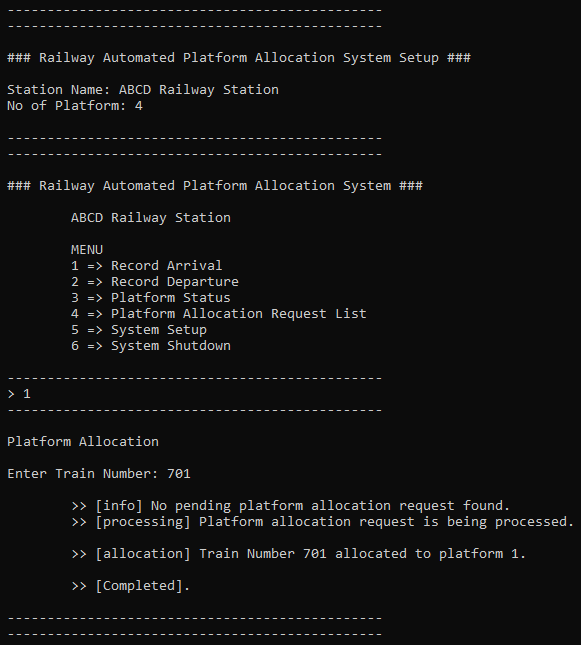
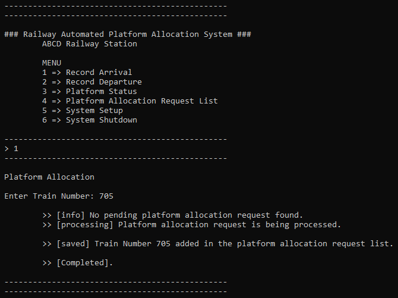
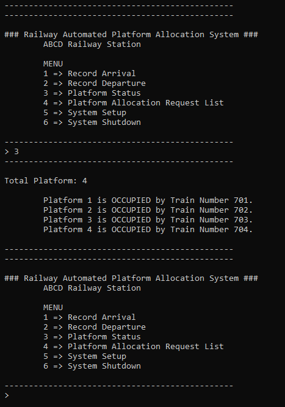
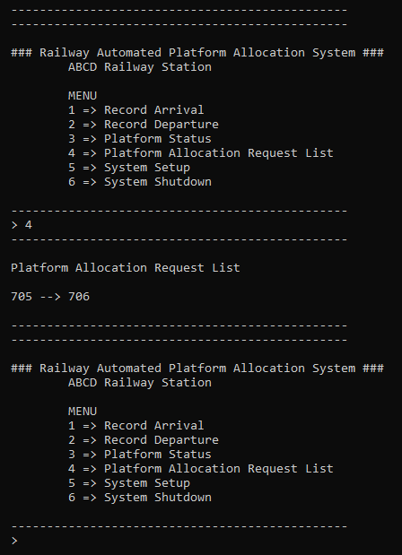
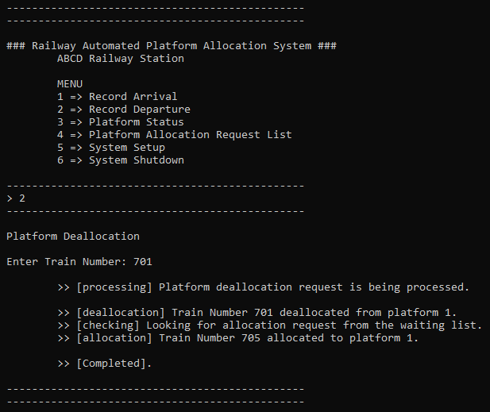

# Railway-Automated-Platform-Allocation-System
A simple railway automated platform allocation system written in C.

# Overview
The system keeps track of platform availability status as well as the trains that are requesting for allocation of the platform.

# Snapshots

# License
[GNU AGPLv3](LICENSE)
